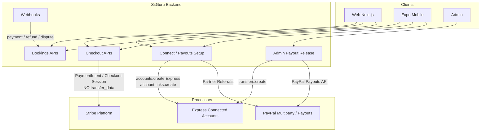
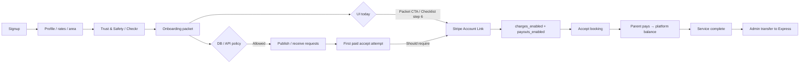

# SitGuru Payments & Guru Onboarding Architecture Audit

**Date:** 2026-09-27  
**Scope:** Repository static analysis + current official Stripe documentation  
**Production mutations:** None (audit only)  
**Stripe live Dashboard / live merchant configs:** NOT VERIFIED (would require Dashboard access)

---

## 1. Executive Summary

1. **What SitGuru has today:** Stripe Connect **Express** accounts for Gurus (and Ambassadors), **Stripe-hosted Account Links** for KYC/bank collection, **separate charges and transfers** (platform Checkout/PaymentIntent → platform balance → admin `transfers.create`), plus a **scaffolded but checkout-disabled PayPal Multiparty** rail.

2. **Why Gurus feel payment friction early:** The **data model already defers payout setup** until accepting the first paid booking, but the **UI does not**. Dashboard checklist step 6 is “Get paid,” and the onboarding packet primary CTA redirects straight into Stripe Connect.

3. **Sensitive financial data:** SitGuru does **not** collect SSN/EIN/routing/full bank numbers in forms. Stripe/Checkr/PayPal collect them on hosted surfaces. Residual risk: optional Photo ID upload into SitGuru storage, and many readiness booleans that can drift.

4. **Modern vs legacy Stripe:** Account creation still uses **legacy `type: "express"`** (not controller properties / Accounts v2). Onboarding method (hosted Account Links) is still Stripe’s supported path. No Custom account KYC forms exist.

5. **Biggest payment risks:** Dual checkout fee math ($0 vs 15–20%); accept-paid gate declared but **not enforced** on mobile accept; **no `account.updated` webhook** for Connect status; dual PayPal onboarding routes; no durable Stripe event-ID store.

6. **Biggest mobile risks:** Connect APIs are **cookie-session only** while mobile uses Bearer JWT (fragile fallback); Account Link return/refresh URLs are **web-only**; iOS Universal Links incomplete; `@stripe/stripe-react-native` installed but unused for PaymentSheet.

7. **Biggest conversion opportunities:** Remove payout from early checklist; keep “Set up payouts” optional until first paid accept; enforce readiness at accept; add onboarding funnel analytics.

8. **Recommended target:** Keep Express (compat layer), keep separate charges/transfers, centralize `PaymentAccountService`, Stripe-hosted onboarding via HTTPS bridge for mobile, PayPal as optional Guru payout rail + future checkout alternative (not a second full marketplace today).

9. **Mandatory payout trigger:** **Before accepting the first paid booking** (already encoded in `user_payout_preferences` / `/api/payouts/setup` rules)—not during signup, not before publish.

10. **Do not migrate existing connected accounts** to a new Connect architecture unless Stripe Dashboard proves they are Custom/API-onboarded (they are Express + Account Links in code).

11. **Instant Payouts:** Not implemented. Eligible as a later enhancement after standard transfer reliability; eligibility must come from backend External Accounts checks.

12. **Implement first (P0):** Observability + accept gate + Connect webhook sync + fee-path consolidation + mobile Connect auth/return bridge—before any fee activation or Instant Payouts.

13. **Existing Gurus:** Keep `stripe_account_id` forever; never rewrite historical payment IDs.

14. **PayPal/Venmo:** Keep as optional payout destination rails; do not enable Pet Parent PayPal checkout until marketplace approval, single onboarding path, and parity with Stripe ledger/webhooks.

15. **NOT VERIFIED:** Live Stripe Dashboard Connect settings, webhook endpoint subscriptions in Dashboard, production RLS effectiveness against live data, CPA/1099 operational process.

---

## 2. Current Architecture

### 2.1 High-level money flow



### 2.2 Guru onboarding vs payout readiness (intended vs UI)



### 2.3 Charge architecture (verified)

| Question | Answer | Evidence |
|---|---|---|
| Destination charges? | **No** | No `transfer_data` / `application_fee_amount` on charge create |
| Direct charges on connected account? | **No** | PIs/Checkout created on platform |
| Separate charges + transfers? | **Yes** | Platform charge + later `stripe.transfers.create({ destination })` |
| Capture mode | **Immediate capture** | Checkout `mode: "payment"`; PI without `capture_method: "manual"` |

Evidence — PaymentIntent (platform only):

```208:233:lib/billing/createCheckoutIntent.ts
  const paymentIntent = await stripe.paymentIntents.create({
    amount: pricing.amountCents,
    currency,
    customer: customerId || undefined,
    // ... metadata only — no transfer_data / application_fee_amount
  });
```

Evidence — Express create:

```103:117:app/api/stripe/connect/route.ts
    const account = await stripe.accounts.create({
      type: "express",
      country: "US",
      business_type: "individual",
      capabilities: {
        card_payments: { requested: true },
        transfers: { requested: true },
      },
    });
```

---

## 3. Current Guru Onboarding Journey

### Web

| Step | Route / surface | Financial ask? |
|---|---|---|
| Marketing | `/become-a-guru` | No |
| Register | `/register?role=guru` → `/signup` | Auth only |
| Role provision | `app/auth/actions.ts`, provision RPCs | Seeds `gurus` with `is_bookable=false`, identity not_started |
| Profile | `/guru/dashboard/profile` | Name/photo/bio/area — ordinary marketplace |
| Pricing | `/guru/dashboard/pricing` | Rates only |
| Availability | `/guru/dashboard/availability` | No bank/KYC |
| Trust & Safety | `/guru/dashboard/background-check` | Checkr hosted (DOB/SSN on Checkr, not SitGuru forms) |
| Packet | `/guru/dashboard/onboarding-packet` | Legal name + tax **acknowledgment** checkboxes; optional Photo ID upload; **primary CTA redirects to Stripe** |
| Dashboard checklist | `GuruSetupChecklist` step 6 “Get paid” | Points to earnings / Connect |
| Earnings / Connect | `/guru/dashboard/earnings` | Starts Express Account Link |
| Booking accept | `/guru/dashboard/bookings` | Soft policy; enforcement incomplete |
| Parent pay | Checkout / PaymentIntent | Card via Stripe Elements or Checkout |
| Payout | Admin release | Transfer to Express |

**Exact early-friction CTA** (packet → Stripe):

```356:358:app/guru/dashboard/onboarding-packet/page.tsx
  if (nextAction === "step6") {
    redirect("/api/stripe/connect/onboard?role=guru");
  }
```

```756:768:app/guru/dashboard/onboarding-packet/page.tsx
            <p>... you’ll set up how you get paid (Step 6).</p>
            <button ... value="step6">
              Submit & set up how I get paid
```

Checklist step 6:

```1750:1761:app/guru/dashboard/page.tsx
    {
      title: "Get paid",
      ...
      href: "/guru/dashboard/earnings",
    },
```

### Mobile

| Step | Screen | Financial ask? |
|---|---|---|
| Setup wizard steps 1–5 | `guru-setup.tsx` | Profile/area/rates/trust/packet — no SSN/bank |
| Step 6 “Prepare Payout Setup” | `guru-setup.tsx` | **Copy only**; does not open Stripe; marks setup complete |
| Dashboard / earnings / payments | `guru-dashboard`, `guru-earnings`, `payments` | Opens Stripe/PayPal via `WebBrowser.openAuthSessionAsync` |
| Accept requests | `guru-requests.tsx` | **No payout readiness check found** |

---

## 4. Friction Findings

### F1 — UI forces payout during onboarding while DB defers it
- **Evidence:** Checklist + packet CTA vs `rules.guruRequirement: "before_accepting_first_paid_booking"` in `app/api/payouts/setup/route.ts` (~1182–1186) and migration `20260724220000_align_shared_payout_schema.sql` (~668–684).
- **Files:** `app/guru/dashboard/page.tsx`, `app/guru/dashboard/onboarding-packet/page.tsx`, `app/api/payouts/setup/route.ts`
- **User impact:** Guru feels they are opening a bank account before receiving marketplace value.
- **Technical impact:** Premature Express account creation; abandoned Account Links; support “why do you need my SSN?” tickets.
- **Severity:** **High** (conversion)
- **Recommendation:** Make payout optional on checklist; change packet primary CTA to “Submit packet”; move Stripe CTA to earnings + first-accept gate.

### F2 — Accept-paid gate declared but not enforced on mobile accept
- **Evidence:** `blockers.acceptFirstPaidBooking` in payouts setup; no matches for payout checks in `guru-requests.tsx`.
- **Severity:** **Critical** (marketplace integrity)
- **Recommendation:** Server-side accept API that requires `can_accept_paid_bookings` / payment readiness before status → accepted.

### F3 — Hardcoded `business_type: "individual"`
- **Evidence:** `app/api/stripe/connect/route.ts:107`, `onboard/route.ts`
- **Severity:** **High** for LLC/EIN Gurus
- **Recommendation:** Allow entity selection before Account Link, or leave unset and let Stripe-hosted onboarding collect it.

### F4 — Optional government ID stored in SitGuru
- **Evidence:** `onboarding-packet` upload `government_id`
- **Severity:** **High** (PII surface)
- **Recommendation:** Prefer Stripe/Checkr identity; restrict SitGuru ID upload to admin-requested cases only; retention policy.

### F5 — Dual Stripe Connect entrypoints
- **Evidence:** `/api/stripe/connect` and `/api/stripe/connect/onboard`
- **Severity:** **Medium**
- **Recommendation:** Single Connect service module; deprecate duplicate route or make thin wrappers.

### F6 — Dual checkout fee paths ($0 vs 15–20%)
- **Evidence:** `app/api/bookings/checkout/route.ts` `MARKETPLACE_FEE_AMOUNT = 0` vs `app/api/stripe/checkout/route.ts` DEFAULT 15%
- **Severity:** **Critical** (pricing integrity)
- **Recommendation:** One pricing service; config-driven fee percent; launch override = 0 without forking charge logic.

### F7 — Connect status sync depends on return URL, not webhooks
- **Evidence:** Stripe webhook switch has no `account.updated` (`app/api/stripe/webhook/route.ts` ~1378–1495)
- **Severity:** **High**
- **Recommendation:** Handle `account.updated` (+ capabilities) as authoritative sync.

### F8 — Mobile Connect auth fragility
- **Evidence:** Connect routes use cookie `getUser()` only; mobile Bearer JWT
- **Severity:** **High** (mobile conversion)
- **Recommendation:** Bearer-aware Connect APIs + HTTPS return bridge deep-linking into app, then re-sync from Stripe.

### F9 — Mobile setup step 6 false completion
- **Evidence:** `guru-setup.tsx` marks complete without Connect
- **Severity:** **Medium**
- **Recommendation:** Separate “setup wizard complete” from “payout ready.”

### F10 — FinishPaymentButton bypasses acceptance gate path
- **Evidence:** `FinishPaymentButton` → `/api/bookings/checkout` (no acceptance gate) vs `/api/stripe/checkout` (`isBookingReadyForCheckout`)
- **Severity:** **High**
- **Recommendation:** Unify checkout entry; enforce same readiness rules.

---

## 5. Stripe Architecture Findings

| Topic | Finding |
|---|---|
| **Account model** | Legacy Express via `type: "express"` (Guru + Ambassador) |
| **Controller properties** | Not used |
| **Accounts API v2** | Not used |
| **API version (pinned)** | `2026-03-25.dahlia` in `lib/stripe/server.ts` and several routes |
| **API version inconsistency** | Some Connect routes construct `new Stripe(secret)` without `apiVersion` |
| **SDK** | `stripe` `^22.0.1`; `@stripe/stripe-js` `^9.1.0`; `@stripe/react-stripe-js` `^6.1.0`; mobile `@stripe/stripe-react-native` `0.64.0` |
| **Account creation** | `accounts.create` in connect routes + Ambassador payouts page REST |
| **Onboarding** | Hosted Account Links `type: "account_onboarding"` |
| **Embedded / AccountSession** | Not present |
| **Charge type** | Separate charges and transfers |
| **Payout model** | Admin-mediated `transfers.create` to Express; Stripe then pays out to Guru bank via Express |
| **Webhook model** | Payment/refund/dispute focused; **no Connect account webhooks** |
| **Requirement handling** | Return URL retrieve + DB flags; schema has `requirements_*` columns but no live `account.updated` sync found |
| **Instant Payouts** | **Not implemented** |
| **Major legacy components** | Dual Connect routes; Ambassador Express create embedded in page; fee forks |

### Stripe docs informing recommendations
- [Connected account types / controller migration](https://docs.stripe.com/connect/migrate-to-controller-properties)
- [Stripe-hosted onboarding / Account Links](https://docs.stripe.com/connect/hosted-onboarding)
- [Marketplace accept payment — destination vs separate charges](https://docs.stripe.com/connect/marketplace/tasks/accept-payment)
- [Separate charges and transfers](https://docs.stripe.com/connect/separate-charges-and-transfers)
- [Instant Payouts for Connect](https://docs.stripe.com/connect/instant-payouts)
- [Hosted onboarding not supported in embedded WebViews](https://docs.stripe.com/connect/marketplace/tasks/onboard)

**Docs vs SitGuru comments:** SitGuru’s Express + Account Links approach remains valid. Newer Stripe guidance prefers **controller properties** for *new* account creation; existing Express accounts can remain. SitGuru should **not** “move Custom → Express” — it is already Express.

---

## 6. PayPal Findings

| Topic | Finding |
|---|---|
| Server client | `lib/paypal/server.ts` |
| Onboarding A | `/api/paypal/onboarding` — Partner Referrals + unified payout tables |
| Onboarding B | `/api/paypal/connect` + `/return` — writes primarily `paypal_merchant_accounts` |
| Checkout | **Hard-disabled** (`PAYPAL_MARKETPLACE_NOT_ENABLED` / “not enabled yet”) |
| Webhooks | `/api/paypal/webhook` — onboarding, capture, refund, dispute, referenced payouts; has event-id dedupe |
| Guru payout release | Admin can pay via PayPal Payouts API |
| Ambassadors | Lightweight PayPal email / Venmo phone destinations (not full merchant KYC) |
| Duplication | Intentional dual-rail scaffolding; Stripe owns money-in today |

**Recommendation:** Option A for PayPal — Stripe primary marketplace/payout infrastructure; PayPal/Venmo as optional Guru/Ambassador payout destinations and future Pet Parent checkout alternative after approval. Do not operate two true parallel marketplace charge rails until operationally ready.

---

## 7. Booking / Payment State Machine

### Current (observed)

```text
pending / requested (unpaid)
    → accepted / confirmed (still may be unpaid depending on path)
    → checkout_started / PENDING_PAYMENT
    → paid + confirmed (webhook)
    → in_progress
    → completed
    → cancelled | refunded | partially_refunded | disputed
```

Operational admin set: `pending → confirmed → in_progress → completed | cancelled` (`app/admin/bookings/[id]/actions.ts`).

Additional free-form statuses appear in product code (`accepted`, `declined`, `awaiting_payment`, etc.). **No hard CHECK constraint** found in reviewed migrations — **NOT VERIFIED** against production DB constraints.

### Money timing
- Card charged: **on successful Checkout/PI** (immediate capture)
- Guru balance: ledger fields / payout rows — **not** automatic Connect destination balance
- Transfer: **admin release** after completion (UI mentions 48h hold; **not code-enforced** in webhook)
- Tips: added to customer total; included in Guru payout estimate; stay on platform until transfer

### Recommended state machine (conceptual)

```text
draft_request
  → requested (visible to Guru; unpaid)
  → declined | expired
  → accepted_pending_payment   [REQUIRES payment_readiness = ready]
  → payment_pending
  → paid_confirmed             [webhook authoritative]
  → in_progress
  → completed_pending_payout
  → payout_released | payout_failed
  → cancelled_* / refund_* / dispute_* overlays
```

Gate: **cannot transition to `accepted_pending_payment` without payout readiness.**  
Parent cannot be charged for a Guru who cannot receive funds.

---

## 8. Web vs Mobile Gap Analysis

| Capability | Web | Mobile | Gap |
|---|---|---|---|
| Parent checkout | Checkout Session + Elements drawer | Hosted Checkout via `openAuthSessionAsync` | Dual web paths; mobile no Elements |
| Stripe RN PaymentSheet | N/A | SDK present, unused | Dead capability |
| Guru Connect | Cookie session redirect | Bearer POST often fails → open cookie onboard URL | Fragile |
| Packet → Stripe | Immediate redirect | Step 6 educational only | UX inconsistency (mobile better for conversion) |
| Accept gate | Soft | None found | Critical |
| PayPal Guru onboard | Supported | Bearer-aware onboarding API | Mostly OK |
| Deep links | HTTPS site | Android App Links; **iOS associatedDomains missing** | Incomplete |
| Connect return | `/api/stripe/return` | Re-poll status; return URLs still web | Incomplete bridge |
| Idempotency-Key on checkout | Server supports | Mobile often omits | Medium |
| Instant payout UI | None | None | — |

---

## 9. Security / Compliance Concerns

| Rank | Issue | Notes |
|---|---|---|
| **Critical** | Fee path bifurcation can under/overcharge | Unify pricing service |
| **Critical** | Accept without payout readiness | Enforce server-side |
| **High** | Optional government ID in SitGuru storage | Minimize / retention |
| **High** | No Connect `account.updated` sync | Stale readiness flags |
| **High** | Mobile Connect cookie-only auth | Session confusion / failed setup |
| **Medium** | No Stripe event-id persistence table | Duplicate webhook processing risk |
| **Medium** | API version inconsistency on Connect clients | Drift risk |
| **Medium** | Biometric fail-open on mobile (`skipped: true`) | `sitguru-mobile` biometrics |
| **Medium** | Dev builds default API URL toward production | Env safeguards |
| **Low** | Analytics denylist exists for SSN/routing | Keep expanding denylist |
| **Low** | Account Link URLs ephemeral — do not log | Confirm logging hygiene (**NOT VERIFIED** log sinks) |

**Principle:** SitGuru stores processor IDs + readiness status; processors store sensitive credentials.

---

## 10. Recommended Architecture

```text
                    WEB  +  MOBILE
                          |
                   SitGuru Backend
                          |
        +-----------------+------------------+
        |                 |                  |
     Bookings      PaymentAccountService   Admin
        |                 |                  |
        |          +------+------+           |
        |          |             |           |
        |       Stripe        PayPal         |
        |       Connect       (payout/opt)   |
        |          |                         |
        |     Express (existing + new)       |
        |          |                         |
        +----- Earnings / Transfers ---------+
```

**Frontend never invents financial truth.** Backend interprets Stripe/PayPal + webhooks.

Keep **separate charges and transfers** because SitGuru holds funds until service completion and admin release — this matches Stripe’s guidance for hold-until-delivery marketplaces ([accept payment](https://docs.stripe.com/connect/marketplace/tasks/accept-payment)).

---

## 11. Migration Options

### Option A — Preserve Express; replace any custom KYC with Stripe-hosted (already mostly true)
- **Complexity:** Low–Medium  
- **Disruption:** Low  
- **Compat:** Excellent  
- **Work:** Decouple UI timing; enforce accept gate; add Connect webhooks; unify Connect routes; mobile bridge  
- **Pros:** Matches current accounts; minimal migration  
- **Cons:** Still on legacy `type: "express"` string  

### Option B — New Gurus use controller-property accounts; keep existing Express IDs
- **Complexity:** Medium  
- **Disruption:** Low for existing Gurus  
- **Compat:** Stripe documents coexistence  
- **Work:** New create path with `controller` hash mirroring Express behavior; compatibility layer in `PaymentAccountService`  
- **Pros:** Aligns with current Stripe recommendations for new creates  
- **Cons:** Two creation shapes; more tests  

### Option C — Full Connect re-architecture / replace accounts
- **Complexity:** High  
- **Disruption:** High  
- **Risk:** Broken historical reconciliation  
- **Pros:** Clean slate  
- **Cons:** Unnecessary given Express + hosted onboarding already  

### Option D (added) — Move to destination charges
- **Not recommended now** — conflicts with hold-until-delivery + admin release design.

---

## 12. Recommended Migration

**Implement Option A immediately, with Option B as a forward-compatible create path when touching account creation.**

Do **not** execute Option C.  
Do **not** change charge model.  
Do **not** enable Instant Payouts or new fees until P0/P1 complete.

**Why:** SitGuru’s core Connect choice (Express + Account Links + separate charges/transfers) is sound. The conversion problem is **when** KYC appears and **whether** readiness is enforced—not “wrong account type.”

---

## 13. Guru UX (text wireframes)

### Registration
```
Join SitGuru as a Guru
Name · Email · Password
[Continue]
No bank. No tax ID. No “financial product” language.
```

### Dashboard — profile live, payout not started
```
You’re ready to be discovered
Your profile can appear to Pet Parents.
You’ll set up secure payouts when you’re ready to accept paid bookings.

[Set Up Payouts]   [Maybe later]
```

### First paid booking request
```
You received a booking request
Before accepting, finish secure payout setup so you can get paid for this care.

Secure payouts powered by Stripe
[Set Up Payouts]
```

### Incomplete onboarding
```
Finish payout setup
Stripe still needs a little more information before you can receive payouts.
[Continue Secure Setup]
```

### Verification pending
```
Stripe is reviewing your information
SitGuru will update your status automatically when review finishes.
You don’t need to resubmit unless we ask.
```

### Payment ready
```
You’re ready to earn
Your payout account is connected.
[View earnings]
```

**Microcopy rules:** Avoid “SitGuru never sees X” unless architecture guarantees it. Prefer “Bank and tax details are collected by Stripe.”

---

## 14. Mobile UX — App / Browser / Deep-link Flow

```text
SitGuru app
  → POST /api/stripe/connect (Bearer JWT)
  → Account Link URL
  → System browser / ASWebAuthenticationSession (NOT WebView)
  → Stripe-hosted onboarding
  → HTTPS return: https://www.sitguru.com/api/mobile/stripe/return?...
  → Bridge redirects to sitgurumobile://guru-earnings?stripe=return
  → App resumes
  → App calls GET /api/payouts/setup (authoritative)
  → Backend retrieves Stripe account / uses last webhook sync
  → UI shows ready | action_required | pending | restricted
```

**Never treat deep-link return alone as success.**

Handle: Save for later, cancel, kill app, expired/double-used Account Link, additional requirements, restricted — all by re-syncing Stripe state.

Stripe docs: hosted onboarding is **not** supported in embedded WebViews.

---

## 15. Database Changes (proposed — DO NOT EXECUTE YET)

### Keep / use existing
- `gurus.stripe_account_id` (immutable once set)
- `user_payout_preferences`, `user_payout_accounts`, `user_payout_destinations`
- `booking_payments`, `guru_payouts` / `payouts`
- `paypal_merchant_accounts`

### Add (minimal)
1. `stripe_webhook_events` (`event_id` PK, `type`, `processed_at`) for idempotency  
2. `payment_accounts` view or thin table keyed by `user_id` + provider with **derived** readiness — or centralize derivation in service without new table  
3. Optional: `bookings.payment_readiness_snapshot` at accept time for support  

### Avoid
- Dozens of new verified booleans  
- Storing full Stripe account payloads  
- Storing SSN/bank numbers  

### Clarify ownership
- Profile publish ≠ payout ready (already true in RPC; enforce in product)  
- Single writer for Connect flags: webhook + explicit sync endpoint  

---

## 16. Backend / API Changes (proposed)

| Endpoint / service | Purpose |
|---|---|
| `PaymentAccountService` | Single interpreter of Stripe/PayPal → readiness DTO |
| `POST /api/stripe/connect` | Bearer + cookie; create/resume Account Link; mobile return URLs |
| `GET /api/payments/account-status` | Web/mobile/admin shared status |
| `POST /api/bookings/[id]/accept` | Enforces payout readiness |
| Unify `/api/bookings/checkout` + `/api/stripe/checkout` | Same fee/acceptance rules |
| `POST /api/mobile/stripe/return` | HTTPS→deep link bridge + sync trigger |

DTO sketch:
```json
{
  "provider": "stripe",
  "accountExists": true,
  "onboardingStatus": "action_required",
  "chargesEnabled": false,
  "payoutsEnabled": false,
  "canAcceptPaidBookings": false,
  "standardPayoutEligible": false,
  "instantPayoutEligible": false,
  "requirementsDue": ["...codes only..."],
  "nextAction": "continue_onboarding",
  "lastSyncedAt": "..."
}
```

---

## 17. Webhook Changes (proposed)

### Stripe — add
- `account.updated` (primary Connect sync)
- Optionally `capability.updated`, `payout.failed`, `transfer.failed` / `transfer.created`

### Stripe — keep
- Checkout + PaymentIntent + refund + dispute handlers

### Reliability
- Persist `event.id` before side effects  
- Signature verify with raw body (already present)  
- Environment-separated secrets  

### PayPal
- Consolidate dual onboarding writers; keep event-id dedupe pattern as reference for Stripe  

---

## 18. Web Changes (proposed)

- Dashboard checklist: remove mandatory “Get paid” or mark optional  
- Packet CTA: submit without forcing Stripe  
- Earnings: primary “Set Up Payouts” with status from PaymentAccountService  
- Accept booking UI: block with friendly copy when not ready  
- Unify Finish Payment → gated checkout  
- Admin Payment Health panel  

---

## 19. Mobile Changes (proposed)

- Bearer-auth Connect  
- HTTPS return bridge + `guru-earnings` deep-link mapping  
- iOS `associatedDomains` / AASA  
- Enforce accept gate via server API (stop client-only status writes for accept)  
- Align setup step 6 copy with deferred payout  
- Pass Idempotency-Key on checkout  
- Keep browser handoff; do not embed WebView for Account Links  
- Defer PaymentSheet until product chooses native card UX (optional)  

---

## 20. Admin Changes (proposed)

Payment Health panel answers:
- Connected account? provider?  
- Onboarding status / action required?  
- Can accept paid bookings?  
- Can receive payouts?  
- Last sync time / last Stripe event  
- Booking PaymentIntent / Checkout IDs  
- Refund / dispute flags  
- Payout release / transfer IDs  

Do **not** show SSN, full bank, Account Link URLs, secrets.

---

## 21. Analytics Funnel

### Recommended events (no KYC values)
`guru_signup_started/completed` → `guru_profile_started/completed` → `guru_profile_published` → `payout_setup_viewed/started/returned/action_required/completed` → `booking_request_received` → `first_booking_accept_attempted` → `first_booking_blocked_payment_setup` → `first_booking_accepted` → `first_booking_completed` → `first_payout_completed`

### KPIs
- Signup completion  
- Profile publication rate  
- Payout start / completion rates  
- Abandonment by onboarding step  
- Time signup → published  
- Time first booking opportunity → payout ready  
- First accept rate  
- First payout success  

Existing analytics track discovery/booking well; Guru financial funnel is largely **missing**.

---

## 22. Testing Plan (matrix)

| Area | Cases |
|---|---|
| Onboarding | new / returning / incomplete / save later / pending / action required / restricted / complete |
| Booking | first accept blocked / after ready / decline / duplicate accept / pay fail / webhook delay / duplicate webhook |
| Refunds | full / partial / after transfer / dispute after payout |
| Payouts | standard transfer / insufficient platform balance / PayPal path / failed transfer |
| Mobile | iOS/Android browser return / kill app / expired link / no return |
| Fees | $0 launch path consistency across all checkout APIs |
| Platforms | desktop Chrome/Safari, mobile Safari/Chrome, iOS, Android |
| Stripe | Official test clocks / test cards / Connect test accounts |

---

## 23. Implementation Phases

| Phase | Focus | Risk |
|---|---|---|
| **0** | Map confirmed; analytics; webhook event store; fee-path audit freeze | Low |
| **1** | Decouple profile UI from payout; PaymentAccountService | Low–Med |
| **2** | Connect webhook sync; single Connect entry; mobile HTTPS bridge | Med |
| **3** | Booking accept gate; unify checkout rules | Med |
| **4** | Mobile accept API + deep links + iOS UL | Med |
| **5** | Earnings UX; evaluate Instant Payouts eligibility API (no activation required) | Med |
| **6** | PayPal rationalization (one onboarding path; checkout remains off) | Med |
| **7** | Optional controller-property creates for **new** accounts only | Low–Med |

Each phase: feature flag where possible; no historical ID rewrites; rollback = disable flag + keep ledger rows.

---

## 24. Files to Modify (when implementation begins)

| Path | Purpose |
|---|---|
| `app/guru/dashboard/page.tsx` | Optional payout checklist |
| `app/guru/dashboard/onboarding-packet/page.tsx` | Stop forced Stripe redirect |
| `app/api/stripe/connect/route.ts` | Bearer auth; shared service; return URLs |
| `app/api/stripe/connect/onboard/route.ts` | Thin wrapper or deprecate |
| `app/api/stripe/return/route.ts` | Sync via service |
| `app/api/stripe/webhook/route.ts` | `account.updated` + event idempotency |
| `app/api/payouts/setup/route.ts` | Consume PaymentAccountService |
| `app/api/bookings/checkout/route.ts` | Align fees + acceptance |
| `app/api/stripe/checkout/route.ts` | Align fees + acceptance |
| `lib/billing/createCheckoutIntent.ts` | Align fee inclusion |
| `components/customer/FinishPaymentButton.tsx` | Unified checkout |
| `app/api/admin/payouts/release/route.ts` | Readiness checks / logging |
| `sitguru-mobile/src/app/guru-setup.tsx` | Deferred payout copy |
| `sitguru-mobile/src/app/guru-requests.tsx` | Server accept gate |
| `sitguru-mobile/src/app/guru-earnings.tsx` | Status from shared API |
| `sitguru-mobile/src/app/payments.tsx` | Idempotency + return handling |
| `sitguru-mobile/app.json` | iOS associated domains |
| New: `lib/payments/payment-account-service.ts` | Authoritative readiness |
| New: mobile return bridge route | HTTPS → deep link |
| Migrations (later) | `stripe_webhook_events` |

---

## 25. Files That Should NOT Be Modified (initially)

- Historical `booking_payments` / `stripe_transactions` rows and their ID columns  
- Existing `gurus.stripe_account_id` values  
- PayPal live webhook signature secrets / rotation (ops only)  
- Unrelated marketing pages, Rogue chat persona, non-payment admin modules  
- Instant Payouts product activation / fee schedule changes  
- Production Stripe Dashboard webhook endpoint URLs (until Phase 2 deliberately)

---

## 26. Risk Register

| Risk | Probability | Impact | Mitigation |
|---|---|---|---|
| Guru accepts without payout setup | High today | High | Server accept gate |
| Wrong fee charged | Medium | Critical | Single pricing module + tests |
| Stale Connect status | High | High | `account.updated` + sync API |
| Mobile onboarding drop-off | High | High | Bearer Connect + HTTPS bridge |
| Dual PayPal state drift | Medium | Medium | Consolidate writers |
| Premature Instant Payouts UX | Medium | Medium | Backend eligibility only |
| Controller migration confusion | Low | High | Keep Express IDs; feature-flag new creates |
| Over-collection of ID docs | Medium | High | Remove default upload path |

---

## 27. Rollback Strategy

- **UI/copy phases:** revert deploy; no data loss  
- **Accept gate:** feature flag; if false positives block Gurus, disable flag; keep audit logs  
- **Webhook handlers:** ignore new event types if buggy; do not delete processed event IDs  
- **New columns:** additive only; stop writing; leave readable  
- **Never** delete `stripe_account_id`, PaymentIntent IDs, transfer IDs, or payout rows  

---

## 28. Final Recommendation

### Keep
- Express connected accounts for existing Gurus  
- Stripe-hosted Account Links (no SitGuru KYC forms)  
- Separate charges and transfers + admin release  
- Unified payout preference model (`user_payout_*`)  
- Analytics PII denylist  

### Fix
- Early UI forcing of payout setup  
- Unenforced accept-paid gate  
- Dual fee math  
- Missing Connect webhooks / event idempotency  
- Mobile Connect auth + return bridge  
- Dual Connect and dual PayPal onboarding entrypoints  

### Replace
- Packet “Submit & set up how I get paid” as primary path  
- Client-side accept status writes without server policy  
- Competing readiness booleans as sources of truth (derive via service)  

### Add
- `PaymentAccountService`  
- Onboarding conversion analytics  
- Admin Payment Health  
- HTTPS mobile return bridge + iOS Universal Links  
- Stripe event store  

### Defer
- Accounts v2  
- Destination charges  
- Instant Payouts productization  
- PayPal Pet Parent checkout enablement  
- Native PaymentSheet  
- Fee activation above $0 launch  

---

## Direct Answers to Decision Questions

1. **Today:** Express + Account Links + platform Checkout/PI + admin Transfers; PayPal scaffolded; $0 fee on some paths, 15–20% on others.  
2. **Friction:** Checklist step 6 + packet CTA push Stripe before value; entity locked to individual; optional ID upload.  
3. **Sensitive data touched:** Not SSN/bank in SitGuru forms; optional Photo ID; legal name; tax ack; processor IDs/status.  
4. **Can Stripe take more?** Already collects KYC/bank; SitGuru should stop optional ID and hardcoding entity when possible.  
5. **Existing accounts:** Remain intact.  
6. **New Gurus:** Same Express-compatible behavior; optional controller-property create later.  
7. **Mandatory payout onboarding:** Before accepting first paid booking (and before any charge that assumes payoutability).  
8. **Web architecture:** Backend-authoritative PaymentAccountService + hosted Account Links + unified checkout.  
9. **Mobile:** Browser handoff Account Links + HTTPS bridge + status re-sync; no WebView.  
10. **PayPal/Venmo:** Optional payout rails; not parallel charge marketplace until ready.  
11. **Standard / Instant Payouts:** Standard via Transfer → Express payouts now; Instant later via eligibility API, never guessed in UI.  
12. **DB:** Additive event store + service-derived readiness; no historical ID rewrites.  
13. **Webhooks:** Add Connect account events + idempotent event log.  
14. **Migrate safely:** Option A (+ optional B for new creates); never Option C by default.  
15. **Implement first:** P0 below.

---

## Prioritized Checklist

### P0 — Critical / Fix Before Further Payment Development
- [ ] Freeze dual fee paths; document which checkout API is canonical for launch ($0)  
- [ ] Add Stripe webhook event-id idempotency store  
- [ ] Handle `account.updated` → refresh Guru/payout readiness  
- [ ] Server-side booking accept gate requiring payout readiness  
- [ ] Stop logging Account Link URLs / secrets (verify sinks)  

### P1 — Guru Onboarding Conversion
- [ ] Remove forced Stripe from packet submit  
- [ ] Make checklist “Get paid” optional with soft CTA  
- [ ] Align web/mobile copy with deferred payout policy  
- [ ] Allow non-individual entity path (or Stripe-collect)  
- [ ] Instrument Guru → payout funnel analytics  

### P2 — Mobile Payment Architecture
- [ ] Bearer JWT on Connect APIs  
- [ ] HTTPS return/refresh bridge → deep link  
- [ ] Map `guru-earnings` in deep-link remapper  
- [ ] Configure iOS Universal Links  
- [ ] Idempotency-Key on mobile checkout  
- [ ] Accept via server API (not client-only)  

### P3 — Payment / Payout Modernization
- [ ] `PaymentAccountService` shared by web/mobile/admin  
- [ ] Unify Connect create/link codepaths  
- [ ] Consolidate PayPal onboarding writers  
- [ ] Optional controller-property creates for new accounts  
- [ ] Instant Payout eligibility probe (display only)  

### P4 — Admin & Analytics
- [ ] Payment Health panel  
- [ ] Funnel KPIs dashboard  
- [ ] Dispute/refund visibility tied to Stripe IDs  

### P5 — Future Enhancements
- [ ] Instant Payouts product UX  
- [ ] PayPal/Venmo Pet Parent checkout (if approved)  
- [ ] Native PaymentSheet  
- [ ] Fee schedule activation beyond launch $0  
- [ ] Accounts v2 evaluation when Stripe feature coverage matches SitGuru needs  

---

## Appendix A — Payment-related file inventory (core)

| File | Platform | Purpose | Provider | Risk | Action |
|---|---|---|---|---|---|
| `lib/stripe/server.ts` | shared library | Stripe SDK singleton | Stripe | API version pin | Keep |
| `lib/stripe/browser.ts` | web | Publishable key loader | Stripe | Key exposure only public | Keep |
| `lib/billing/createCheckoutIntent.ts` | backend | PaymentIntent create | Stripe | Fee omission vs Checkout | Align fees |
| `lib/billing/pricingCalculator.ts` | shared | Pricing | — | No marketplace fee | Align |
| `lib/paypal/server.ts` | backend | PayPal client | PayPal | Dual env | Keep |
| `lib/payments/payment-methods.ts` | shared | Catalog abstraction | both | Not charge engine | Extend carefully |
| `app/api/stripe/connect/route.ts` | API | Express + Account Link | Stripe | Cookie-only; individual lock | Fix |
| `app/api/stripe/connect/onboard/route.ts` | API | Duplicate Connect | Stripe | Drift | Consolidate |
| `app/api/stripe/return/route.ts` | API | Post-onboard sync | Stripe | Incomplete vs webhooks | Enhance |
| `app/api/stripe/checkout/route.ts` | API | Hosted Checkout | Stripe | 15–20% fees | Canonicalize |
| `app/api/bookings/checkout/route.ts` | API | Alternate Checkout | Stripe | $0 fee; weak accept gate | Align |
| `app/api/checkout/create-intent/route.ts` | API | Elements intent | Stripe | Dual path | Align |
| `app/api/stripe/webhook/route.ts` | webhook | Payment events | Stripe | No account.updated; no event store | Fix |
| `app/api/paypal/onboarding/route.ts` | API | Partner Referrals | PayPal | Overlaps connect | Consolidate |
| `app/api/paypal/connect/route.ts` | API | Legacy onboard | PayPal | Dual write | Consolidate |
| `app/api/paypal/webhook/route.ts` | webhook | PayPal events | PayPal | Complex | Keep + simplify | 
| `app/api/payouts/setup/route.ts` | API | Readiness + prefs | both | Source of policy truth | Centralize |
| `app/api/admin/payouts/release/route.ts` | admin | Transfer/PayPal payout | both | Manual ops critical | Keep harden |
| `app/api/mobile/payments/checkout/route.ts` | mobile API | Checkout alias | Stripe | Thin | Keep |
| `app/api/mobile/payments/return/route.ts` | mobile API | Deep link bridge | Stripe | Ignores some returnUrl | Fix |
| `components/checkout/*` | web UI | Elements checkout | Stripe | Dual UX | Keep/align |
| `components/customer/FinishPaymentButton.tsx` | web UI | Finish pay | Stripe | Bypass gate | Fix |
| `app/guru/dashboard/page.tsx` | web | Checklist | — | Early payout step | Fix |
| `app/guru/dashboard/onboarding-packet/page.tsx` | web | Packet + Stripe CTA | Stripe | Friction + ID upload | Fix |
| `app/guru/dashboard/earnings/page.tsx` | web | Earnings/Connect | Stripe | OK | Enhance status |
| `app/ambassador/dashboard/payouts/page.tsx` | web | Amb Express create | Stripe | Logic in page | Extract |
| `sitguru-mobile/src/app/payments.tsx` | mobile | Pay + Connect | Stripe | Auth/idempotency | Fix |
| `sitguru-mobile/src/app/guru-earnings.tsx` | mobile | Earnings/Connect | both | Duplicate open flow | Share helper |
| `sitguru-mobile/src/app/guru-setup.tsx` | mobile | Wizard | — | False payout complete | Fix |
| `sitguru-mobile/src/app/guru-requests.tsx` | mobile | Accept/decline | — | No payout gate | Fix |
| `sitguru-mobile/src/components/SitGuruPaymentsProvider.native.tsx` | mobile | StripeProvider | Stripe | Unused PaymentSheet | Defer |
| `supabase/migrations/202607160003_create_booking_payments.sql` | database | Payment ledger | — | Core | Keep |
| `supabase/migrations/202607180001_create_unified_payment_payout_model.sql` | database | Payout model | both | Core | Keep |
| `supabase/migrations/20260724220000_align_shared_payout_schema.sql` | database | Readiness RPC | both | Policy source | Keep |
| `supabase/migrations/20260723221500_create_paypal_merchant_accounts.sql` | database | PayPal merchants | PayPal | Dual with user_payout_accounts | Consolidate usage |

Full search found ~313 paths mentioning payment terms; treat marketing/help/admin reporting as secondary.

---

## Appendix B — Sensitive field matrix (summary)

| Field | SitGuru collects? | Stripe/3P? | SitGuru stores? | Necessary? | Stage OK? |
|---|---|---|---|---|---|
| SSN | No | Yes (Stripe/Checkr) | No | No | Only in hosted KYC |
| EIN | No | Yes | No | No | Blocked by individual preset |
| Bank/routing | No | Yes | No | No | Hosted only |
| DOB | No | Yes | No | No | Hosted only |
| Photo ID | Optional upload | Yes | Yes if uploaded | Usually no | Prefer 3P |
| Tax ack | Yes (boolean) | — | Yes | OK | Packet |
| Legal name | Yes | Yes | Yes | OK | Prefill Stripe |
| Stripe account id | Created | — | Yes | Yes | On Connect start |
| PayPal merchant id | Via referral | — | Yes | Yes | On PayPal start |

---

## Appendix C — Cross-platform capability matrix

| Capability | Desktop Web | Mobile Web | iOS App | Android App | Admin |
|---|---|---|---|---|---|
| Signup | Yes | Yes | Yes | Yes | N/A |
| Profile | Yes | Yes | Yes | Yes | View/edit |
| Payout setup start | Yes | Yes | Partial (auth fragile) | Partial | View |
| Continue onboarding | Yes | Yes | Partial | Partial | Trigger sync needed |
| Booking acceptance | Yes | Yes | Yes (ungated) | Yes (ungated) | Override |
| Checkout | Yes | Yes | Hosted browser | Hosted browser | N/A |
| Standard payout status | Partial | Partial | Partial | Partial | Release tools |
| Instant payout | No | No | No | No | No |
| Refund visibility | Limited | Limited | Limited | Limited | Via webhooks/UI |
| Payment failure UX | Mixed | Mixed | Mixed | Mixed | Logs |
| Deep-link return | N/A | N/A | Incomplete UL | App Links | N/A |
| Account restriction UX | Weak | Weak | Weak | Weak | Needed |
| Reconnect / update | Account Link refresh | Same | Same | Same | Needed |

---

## Appendix D — Recommended error-message matrix

| Technical signal | User-facing message |
|---|---|
| `charges_enabled=false` / incomplete onboarding | Finish your secure payout setup before accepting this booking. |
| `requirements.currently_due` / past_due | Stripe needs a little more information before payouts can continue. |
| `payouts_enabled=false` restricted | Your payout account is restricted. Continue secure setup or contact support. |
| Card declined | Your card was declined. Try another card or contact your bank. |
| PaymentIntent/Checkout create fail | We couldn’t start checkout. Please try again in a moment. |
| Transfer insufficient balance | Payout couldn’t be released yet. SitGuru will retry when funds are available. |
| Account Link expired | Your secure setup link expired. Tap Continue to open a new one. |
| PayPal marketplace disabled | PayPal checkout isn’t available yet. Please pay with card. |
| Duplicate accept | This booking was already accepted. |
| Webhook delay after return | We’re confirming with Stripe—this can take a moment. |

Preserve raw codes in server/admin logs only.

---

*End of audit. No production code, migrations, Stripe accounts, secrets, or live payment state were modified.*
